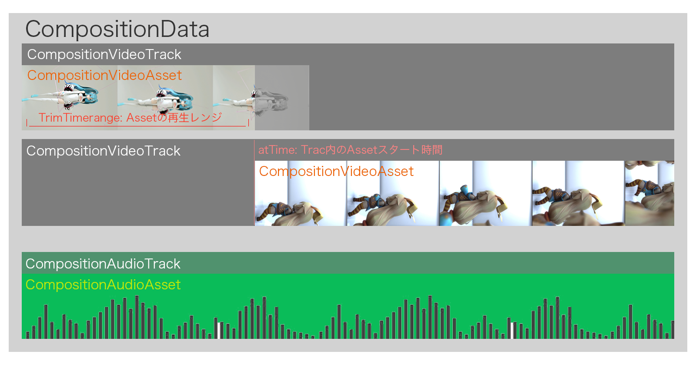

# CameraCore

[](https://developer.apple.com/swift/)
[](https://developer.apple.com/swift/)
[](https://developer.apple.com/swift/)


## 概要

このフレームワークは、映像や音声を少ない手続き・インターフェースで使えることを目指しています。

少ないコードで 動画の 撮影・再生・編集・エンコード を行うことができます。


#### 参考

* [AVFoundation プログラミングガイド](https://developer.apple.com/jp/documentation/AVFoundationPG.pdf)


## カメラ起動・Video撮影
### MetalVideoCaptureView（MTKView）

Class: [MetalVideoCaptureView.swift](https://github.com/Hideyuki-Machida/CameraCore/blob/master/CameraCore/Renderer/VideoCapture/MetalVideoCaptureView.swift)

Protocol: [VideoCaptureViewProtocol.swift](https://github.com/Hideyuki-Machida/CameraCore/blob/master/CameraCore/Renderer/VideoCapture/VideoCaptureViewProtocol.swift)

Example: [MetalVideoCaptureViewExampleVC.swift](https://github.com/Hideyuki-Machida/CameraCore/blob/master/Example/CameraCoreExample/MetalVideoCaptureViewExampleVC.swift)


## CompositionDataをセットし、Videoを再生
### MetalVideoPlaybackView（MTKView）

Class: [MetalVideoPlaybackView.swift](https://github.com/Hideyuki-Machida/CameraCore/blob/master/CameraCore/Renderer/CompositionAVPlayer/MetalVideoPlaybackView.swift)

Protocol: [CompositionAVPlayerProtocol.swift](https://github.com/Hideyuki-Machida/CameraCore/blob/master/CameraCore/Renderer/CompositionAVPlayer/CompositionAVPlayerProtocol.swift)

Example: [MetalVideoPlaybackViewExampleVC.swift](https://github.com/Hideyuki-Machida/CameraCore/blob/master/Example/CameraCoreExample/MetalVideoPlaybackViewExampleVC.swift)


## CompositionDataをセットし、Video・Audioを再生
### CompositionAVPlayer

Class: [MetalCompositionAVPlayer.swift](https://github.com/Hideyuki-Machida/CameraCore/blob/master/CameraCore/Renderer/CompositionAVPlayer/MetalCompositionAVPlayer.swift)

Protocol: [CompositionAVPlayerProtocol.swift](https://github.com/Hideyuki-Machida/CameraCore/blob/master/CameraCore/Renderer/CompositionAVPlayer/CompositionAVPlayerProtocol.swift)

Example: [CompositionAVPlayerExampleVC.swift](https://github.com/Hideyuki-Machida/CameraCore/blob/master/Example/CameraCoreExample/CompositionAVPlayerExampleVC.swift)


## ImageProcessing
### RenderLayer

ビデオのフレーム毎に画像処理をしたい場合に用いるレイヤー（PhotoShopの調整レイヤーのイメージ）

Protocol: [RenderLayerProtocol.swift](https://github.com/Hideyuki-Machida/CameraCore/blob/master/CameraCore/ImageProcessing/RenderLayerProtocol.swift)

Example: [RenderLayerExampleVC.swift](https://github.com/Hideyuki-Machida/CameraCore/blob/master/Example/CameraCoreExample/RenderLayerExampleVC.swift)


## コンポジションしたビデオをエンコード & 保存
### VideoEncoder

Protocol: [VideoBitRateEncoder.swift](https://github.com/Hideyuki-Machida/CameraCore/blob/master/CameraCore/Encoder/VideoBitRateEncoder.swift)

Example: [VideoBitRateEncoderExampleVC.swift](https://github.com/Hideyuki-Machida/CameraCore/blob/master/Example/CameraCoreExample/VideoBitRateEncoderExampleVC.swift)


## CompositionData

CameraCoreの基本データModel

```
CompositionData
CompositionTrackProtocol (CompositionVideoTrack, CompositionAudioTrack)
CompositionAssetProtocol (CompositionVideoAsset, CompositionAudioAsset)
```

|Data|Track|Asset|
|:---|:---|:---|
|CompositionData|CompositionVideoTrack {n個}|CompositionVideoAsset {n個}|
||CompositionAudioTrack {n個}|CompositionAudioAsset {n個}|

編集結果のパラメータを持つ CompositionData は<br>
複数のTrack、さらに複数のAssetで構成されます。<br>
※ 下記の図のように、動画編集ソフトのタイムラインのように扱います。


